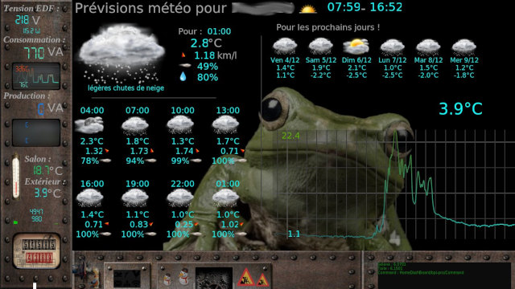
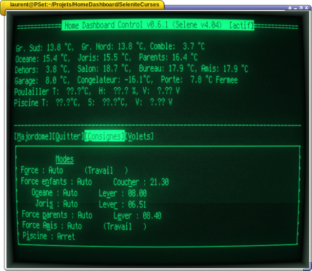

# Séléné

**Séléné** is a lightweight and versatile framework to build **Lua** event driven application.

**Séléné** provides :

* **tasks list** management : tasks needing to run in sequence or which doesn't need to be real-time are queued. They will be launched when main application thread is idle
* **Asynchroneous tasks** : tasks can detach from their mother process. Unlike Lua's coroutine, they are working totally independently, without having to manage concurrent access to their own context. Especially suitable for realtime actions.
* **data exchange** between tasks are managed using shared variables or data queues (have a look on **SelShared** and **Collection** objects). Notez-bien : due to Lua's limitation, *detached tasks* can't access to objects (including functions) declared in the main thread, Shared objects and collection handle data sharing as well as locking to avoid race condition and concurrent access.
* Tasks are waked-up by various types of **events** : 
	* **timers** (absolute and relative times)
	* **MQTT** messages arrivals. Consequently, an external application can trigger a tasks by sending an MQTT message. Séléné provides some APIs to expose MQTT payload to Lua scripts and can send new messages.
	* **files’ events**
	* **Unix events**
	* … 

Thanks to plug-ins, **Séléné** allows to easily create events driven dashboard :
* **Text based** ones using the industry standard *Curses library*
* Graphicals ones :
	* Tiny **OLED** displays
	* Linux **Framebuffers** so without having to install and manage obese X layer  

---

## Pluggins dashboard examples

### DRM/Cairo

**DRM/Cairo** dashboard *more elaborate graphics especially with transparency

### DirectFB

**DirectFB** dashboard *flat design due to constraints of the screen used*

### Curses

Textusal **Curses** dashboard *displayed on a old terminal : Séléné only manages the text itself*

---

[docs directory](docs/) containes various ... documentations : installation procedures, API of pluggins ...

---

Even if I don't have time for a descent fully featured documentation, you may find some informations in :
- **Doc subdirectory** especially regarding Lua's exposed API
- all comprehensive examples files in **Selenites????** subdirectories.
- probably in source code as well.

All good wishes are welcome if someone wants to get on with the job.
