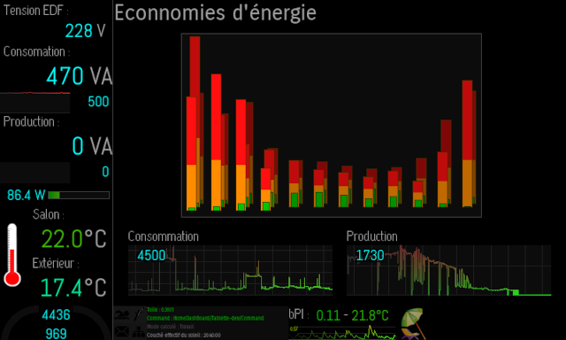

# Séléné

**Séléné** is a lightweight and versatile framework to build **Lua** and **C** event driven application.

---

> [!CAUTION]
> **master** branch may not compile with recent compilers due to standard's changes. 
> **Toile** will, but most of plugins are not yet available within Toile branche.

---

**Séléné** provides :

* **tasks list** management : tasks needing to run in sequence or which doesn't need to be real-time are queued. They will be launched when main application thread is idle. If needed, dupplication can be avoided and hight priority tasks can be put on the top of the todo list.
* **Asynchronous tasks** : tasks can detach from their mother process. Unlike [Lua's coroutine](https://www.lua.org/pil/9.1.html), they are working totally independently, without having to manage concurrent access to their own context. *Detached tasks* are particularly suited to real-time actions or massive events management, at the cost of some limitations :  
⚠️ due to Lua's limitation, *detached tasks* can't access to objects (including functions) declared in the main thread, Shared objects and collections handle data sharing as well as locking to avoid race condition and concurrent access ⚠️
* **data exchange** between tasks are managed using shared variables or data queues (have a look on **SelShared** and **Collection** objects). 
* Tasks are waked-up by various types of **events** : 
	* **timers** (absolute and relative times)
	* **MQTT** messages arrivals. Consequently, an external application can trigger tasks by sending an MQTT message. Séléné provides some APIs to expose MQTT payload to Lua scripts and can send new messages.
	* **files’ events**
	* **Unix events**
	* … 

Thanks to plug-ins, **Séléné** allows to easily create events driven dashboard :
* **Text based** ones using the industry standard *Curses library*
* Graphicals ones :
	* Tiny **OLED** displays
	* Linux **Framebuffers** so without having to install and manage obese X layer
 * well known **I2C LCD text display** (like famous 16x02 ones). C/C++ support provided as well.

---

As of Séléné V7 :
- a **weak linking mechanism** aiming to enforce strong upward compatibility, and allowing upgrading Séléné without having to recompile applications relying on its API.
- **C** API to use Selene shared data managements, logs ... to fully C or C++ projects.

---

## Pluggins dashboard examples

### DRM/Cairo

**DRM/Cairo** dashboard *more elaborated graphics especially with transparency*

<!---
### DirectFB

**DirectFB** dashboard *flat design due to constraints of the screen used*
--->

### Curses

Textual **Curses** dashboard *displayed on a old terminal : Séléné only manages the text itself*

### Oled

Small system dashboard on a tiny **OLED** display.

### LCD

Display useful information on small and cheap **LCD** display with the capability to customize characters.

20x04 **LCD** is supported as well.

---

[docs directory](docs/) contains various ... documentations : installation procedures, API of plugins ...
